<div align="center">

[](https://github.com/pratikluhana)

</div>

---

## 🧑‍💻 About Me

```python
class PratikLuhana:
    def __init__(self):
        self.name         = "Pratik Luhana"
        self.role         = "Principal Cyber Security Professional"
        self.experience   = "~10 years in Cybersecurity as Professional"
        self.passions     = ["Cyber Security Researcher", "Hacking AI", "Securing AI", "Quantum Security", "IOT & Hardware Hacking"]

    def current_focus(self):
        return [
            "🤖 AI/LLM Vulnerability Assessment (OWASP LLM Top 10)",
            "⚛️  Quantum Computing & Quantum Encryption",
            "🔬 Red Team / Blue Team Operations",
            "🌑 Dark Web & Dark Net Research",
        ]

    def community(self):
        return "Speaker • Mentor • Cyber Security Consultant"
```

---

## 🛡️ Expertise & Skills

<div align="center">

| Domain | Skills |
|---|---|
| **Offensive Security** | VAPT • Bug Bounty • Red Teaming |
| **AI / LLM Security** | AI Agent Security • RAG Security • MCP Security • AI Threat Model • Prompt Injection • Jailbreaks • OWASP LLM Top 10 • AI VAPT |
| **Hardware & IoT** | Hardware Hacking • IoT Security • Car Hacking • UWB - Ultra Wide Band Hacking |
| **Governance & Compliance** | Information Security Audits • GRC • ISO Standards |
| **Emerging Tech** | Quantum Encryption • Post-Quantum Cryptography (PQC) • Dark Web Intelligence • Credential Leak Monitoring • Data Breach Analysis|
| **Application Security** | Web Vulnerability Assessment • Infrastructure Security |

</div>

---

## 🚀 Featured Projects

<div align="center">

| Project | Description | Tech |
|---|---|---|
| [🛡️ AIVA](https://github.com/pratikluhana/AIVA) | **AI Vulnerability Assessment** — VAPT scanner for LLM endpoints testing OWASP LLM Top 10 (prompt injection, jailbreaks, system-prompt leakage, data disclosure) with infra recon |  |
| [🔧 Hardware-Hacking-Talk-Tools](https://github.com/pratikluhana/Hardware-Hacking-Talk-Tools) | Tools for **Hardware & IoT Hacking** talks and workshops |  |
| [⚛️ Quantum-Secured-Communication](https://github.com/pratikluhana/Quantum-Secured-Communication) | Research on **Quantum Encryption** and secure communication protocols |  |
| [🌐 Web-Vulnerability-Scanner](https://github.com/pratikluhana/Web-Vulnerability-Scanner) | Automated **web vulnerability detection** tool |  |
| [🐍 P4RS3LT0NGV3](https://github.com/pratikluhana/P4RS3LT0NGV3) | **Parseltongue 3.1** — LLM Payload Crafter for AI safety research |  |
| [🔴🔵 redbluepurpleAI](https://github.com/pratikluhana/redbluepurpleAI) | **AI-powered Red/Blue/Purple** team operations framework |  |

</div>

---

<!--
  Crafted by Pratik Luhana⁠⁡⁠⁠⁠⁠⁡⁡⁠⁡⁡⁡⁠⁠⁡⁠⁠⁡⁡⁠⁠⁠⁠⁡⁠⁡⁡⁠⁠⁡⁡⁠⁠⁡⁡⁡⁠⁡⁠⁠⁠⁡⁡⁠⁠⁡⁠⁡⁠⁡⁡⁠⁠⁡⁠⁠⁠⁡⁠⁠⁠⁠⁡⁠⁠⁡⁡⁡⁡⁠⁠⁡⁠⁡⁠⁡⁠⁠⁠⁠⁠⁡⁡⁡⁠⁠⁡⁠⁠⁡⁡⁠⁠⁠⁠⁡⁠⁡⁡⁡⁠⁡⁠⁠⁠⁡⁡⁠⁡⁠⁠⁡⁠⁡⁡⁠⁡⁠⁡⁡⁠⁡⁠⁠⁡⁡⁠⁠⁠⁡⁡⁡⁠⁡⁠⁡⁠⁡⁡⁠⁡⁠⁠⁠⁠⁡⁡⁠⁠⁠⁠⁡⁠⁡⁡⁠⁡⁡⁡⁠⁠⁡⁡⁠⁠⁠⁠⁡⁠⁠⁡⁠⁡⁡⁠⁡⁠⁡⁡⁠⁠⁡⁡⁡⁠⁡⁡⁠⁡⁠⁠⁡⁠⁡⁡⁡⁠⁡⁠⁠⁠⁡⁡⁠⁡⁠⁠⁠⁠⁡⁡⁡⁠⁡⁠⁡⁠⁡⁡⁠⁠⁠⁡⁠⁠⁠⁡⁠⁡⁡⁡⁠⁠⁡⁡⁠⁠⁠⁡⁡⁠⁡⁡⁠⁡⁡⁡⁡⁠⁡⁡⁠⁡⁡⁠⁡⁠⁠⁡⁠⁡⁡⁡⁡⁠⁡⁡⁡⁠⁠⁠⁠⁠⁡⁡⁡⁠⁠⁡⁠⁠⁡⁡⁠⁠⁠⁠⁡⁠⁡⁡⁡⁠⁡⁠⁠⁠⁡⁡⁠⁡⁠⁠⁡⁠⁡⁡⁠⁡⁠⁡⁡⁠⁡⁡⁠⁡⁡⁠⁠⁠⁡⁡⁡⁠⁡⁠⁡⁠⁡⁡⁠⁡⁠⁠⁠⁠⁡⁡⁠⁠⁠⁠⁡⁠⁡⁡⁠⁡⁡⁡⁠⁠⁡⁡⁠⁠⁠⁠⁡⁢‍
  root@pratikluhana:~$ whoami && exit
-->
## 📊 GitHub Stats

<div align="center">


</div>

<div align="center">


</div>

---

## 🎤 Speaking & Community

- 🏆 **The Hackers Meetup** - Active contributor to local Community
- 👮 **GDG Gandhinagar** - Active contributor to local Community
- 🧑‍🏫 **Hackathons** - Active contributor as a Judge/Mentor
- 👮 **CISO Meetups** - Active contributor to CISO Meetups, where security leaders come together to exchange insights, discuss emerging cyber threats, and explore the future of information security.
- 🧑‍🏫 **GDG Gandhinagar** - Active contributor to local Community
- 🎙️ **The Hackers Meetup** - Speaker on *Car Hacking* (RFID, Keyless Entry, WiFi Hacking)
- 🏆 **HackSec 2023/2025** - Speaker on Hardware & Emerging Technology Security / *GRC (Governance, Risk & Compliance)*
- 👮 **Parul University** - Speaker on RFID Hacking & IoT Forensics in collaboration with Netweb Software, Speaker on Car Hacking & Key Fob Unlocking with extended RFID & IoT Hacking
- 🎓 **University Talks** - Invited as a guest speaker, delivering technical talks and hands-on sessions on a wide range of cybersecurity topics, including offensive security, AI security, hardware hacking and IoT security
- 👮 **Cyber Crime Intervention Officer** - Active contributor to local cyber crime prevention
- 🧑‍🏫 **Mentor** - Guiding next-gen cybersecurity professionals

---


## 🧰 Skills & Tools Arsenal
 

<b>🎯 Offensive Security / VAPT</b>

[](https://portswigger.net/burp)
[](https://pratikluhana.com)
[](https://pratikluhana.com)
[](https://pratikluhana.com)
[](https://pratikluhana.com)
[](https://pratikluhana.com)
[](https://pratikluhana.com)
[](https://pratikluhana.com)
[](https://pratikluhana.com)
[](https://pratikluhana.com)
[](https://pratikluhana.com)
[](https://pratikluhana.com)
[](https://pratikluhana.com)
[](https://pratikluhana.com)
[](https://pratikluhana.com)
[](https://pratikluhana.com)
 
</div>


<b>🐛 Bug Bounty & Threat Intel</b>

[](https://pratikluhana.com)
[](https://pratikluhana.com)
[](https://pratikluhana.com)
[](https://pratikluhana.com)
[](https://pratikluhana.com)
[](https://pratikluhana.com)
[](https://pratikluhana.com)
[](https://pratikluhana.com)
[](https://pratikluhana.com)
[](https://pratikluhana.com)
[](https://pratikluhana.com)
[](https://pratikluhana.com)
[](https://pratikluhana.com)
[](https://pratikluhana.com)
[](https://pratikluhana.com)
 
</div>


<b>🔒 DevSecOps & Compliance</b>

[](https://pratikluhana.com)
[](https://pratikluhana.com)
[](https://pratikluhana.com)
[](https://pratikluhana.com)
[](https://pratikluhana.com)
[](https://pratikluhana.com)
[](https://pratikluhana.com)
[](https://pratikluhana.com)
[](https://pratikluhana.com)
[](https://pratikluhana.com)
[](https://pratikluhana.com)
[](https://pratikluhana.com)
[](https://pratikluhana.com)
[](https://pratikluhana.com)
[](https://pratikluhana.com)
[](https://pratikluhana.com)
[](https://pratikluhana.com)
 
</div>


<b>☁️ Cloud & Infrastructure</b>

[](https://pratikluhana.com)
[](https://pratikluhana.com)
[](https://pratikluhana.com)
[](https://pratikluhana.com)
[](https://pratikluhana.com)
[](https://pratikluhana.com)
[](https://pratikluhana.com)
[](https://pratikluhana.com)
[](https://pratikluhana.com)
[](https://pratikluhana.com)
[](https://pratikluhana.com)
[](https://pratikluhana.com)
[](https://pratikluhana.com)
[](https://pratikluhana.com)
 
</div>


<b>🤖 AI / LLM Security</b>

[](https://pratikluhana.com)
[](https://pratikluhana.com)
[](https://pratikluhana.com)
[](https://pratikluhana.com)
[](https://pratikluhana.com)
[](https://pratikluhana.com)
 
</div>


<b>🔌 Hardware / IoT Hacking</b>

[](https://pratikluhana.com)
[](https://pratikluhana.com)
[](https://pratikluhana.com)
[](https://pratikluhana.com)
 
</div>


<b>💻 Languages & Scripting</b>

[](https://pratikluhana.com)
[](https://pratikluhana.com)
[](https://pratikluhana.com)
[](https://pratikluhana.com)
[](https://pratikluhana.com)
[](https://pratikluhana.com)
[](https://pratikluhana.com)
[](https://pratikluhana.com)
 
</div>


<b>🗄️ Databases & Operating Systems</b>

[](https://pratikluhana.com)
[](https://pratikluhana.com)
[](https://pratikluhana.com)
[](https://pratikluhana.com)
[](https://pratikluhana.com)
[](https://pratikluhana.com)
 
</div>


<b>🛠️ Forensics & Misc</b>

[](https://pratikluhana.com)
[](https://pratikluhana.com)
[](https://pratikluhana.com)
[](https://pratikluhana.com)
[](https://pratikluhana.com)
[](https://pratikluhana.com)
[](https://pratikluhana.com)
[](https://pratikluhana.com)
[](https://pratikluhana.com)
[](https://pratikluhana.com)
[](https://pratikluhana.com)
[](https://pratikluhana.com)
 
</div>


---

<div align="center">

### 💬 *"By the Hackers. For the Hackers. Keep Hacking."*

<br/>

[](https://github.com/pratikluhana)

<br/>
</div>


---


  ## 💰 You can help me by Donating
  [](https://www.paypal.com/paypalme/pratikluhana) 


<!--
  Crafted by Pratik Luhana⁠⁡⁠⁠⁠⁠⁡⁡⁠⁡⁡⁡⁠⁠⁡⁠⁠⁡⁡⁠⁠⁠⁠⁡⁠⁡⁡⁠⁠⁡⁡⁠⁠⁡⁡⁡⁠⁡⁠⁠⁠⁡⁡⁠⁠⁡⁠⁡⁠⁡⁡⁠⁠⁡⁠⁠⁠⁡⁠⁠⁠⁠⁡⁠⁠⁡⁡⁡⁡⁠⁠⁡⁠⁡⁠⁡⁠⁠⁠⁠⁠⁡⁡⁡⁠⁠⁡⁠⁠⁡⁡⁠⁠⁠⁠⁡⁠⁡⁡⁡⁠⁡⁠⁠⁠⁡⁡⁠⁡⁠⁠⁡⁠⁡⁡⁠⁡⁠⁡⁡⁠⁡⁠⁠⁡⁡⁠⁠⁠⁡⁡⁡⁠⁡⁠⁡⁠⁡⁡⁠⁡⁠⁠⁠⁠⁡⁡⁠⁠⁠⁠⁡⁠⁡⁡⁠⁡⁡⁡⁠⁠⁡⁡⁠⁠⁠⁠⁡⁠⁠⁡⁠⁡⁡⁠⁡⁠⁡⁡⁠⁠⁡⁡⁡⁠⁡⁡⁠⁡⁠⁠⁡⁠⁡⁡⁡⁠⁡⁠⁠⁠⁡⁡⁠⁡⁠⁠⁠⁠⁡⁡⁡⁠⁡⁠⁡⁠⁡⁡⁠⁠⁠⁡⁠⁠⁠⁡⁠⁡⁡⁡⁠⁠⁡⁡⁠⁠⁠⁡⁡⁠⁡⁡⁠⁡⁡⁡⁡⁠⁡⁡⁠⁡⁡⁠⁡⁠⁠⁡⁠⁡⁡⁡⁡⁠⁡⁡⁡⁠⁠⁠⁠⁠⁡⁡⁡⁠⁠⁡⁠⁠⁡⁡⁠⁠⁠⁠⁡⁠⁡⁡⁡⁠⁡⁠⁠⁠⁡⁡⁠⁡⁠⁠⁡⁠⁡⁡⁠⁡⁠⁡⁡⁠⁡⁡⁠⁡⁡⁠⁠⁠⁡⁡⁡⁠⁡⁠⁡⁠⁡⁡⁠⁡⁠⁠⁠⁠⁡⁡⁠⁠⁠⁠⁡⁠⁡⁡⁠⁡⁡⁡⁠⁠⁡⁡⁠⁠⁠⁠⁡⁢‍
  root@pratikluhana:~$ whoami && exit
-->

